# Synthis — AI Research Assistant

A production-grade, AI-augmented Grounded Research Platform powered by **FastAPI**, **Google Gemini 2.5 Flash**, **Tavily Web Retrieval API**, and **React 19 + Vite**. Features multi-query intent planning, Google Scholar-style retrieval filtering (date range, domain allowlist/blocklist, topic scope), real-time deduplication, grounded per-source LLM summarization, synthesized executive reports with verifiable inline citations `[S1]`, interactive hover-card citation popovers, research depth tuning (Quick Scan / Standard / Deep Research), Web Speech Synthesis audio summary narration, slide-out past report history drawer, raw Markdown & JSON exports, native print/PDF layouts, and a zero-hallucination citation verification engine.

## Features

### Core Pipeline & Grounding
- **Multi-Query Intent Planning**: Automatically breaks user research topics into 2–6 non-overlapping, targeted search queries covering background, current developments, technical details, and expert perspectives — query count scales with the selected depth mode.
- **Tavily Web Retrieval**: Integrates with Tavily Search API to execute queries with automatic retry and exponential backoff, fetching high-relevance web documents with snippet metadata. All filter parameters are passed natively to Tavily's `/search` endpoint — zero client-side post-filtering.
- **Source Filtering & Deduplication**: Normalizes URLs, removes duplicate domains, enforces max per-domain caps, filters low-relevance snippets, and re-indexes contiguous stable source IDs (`S1`, `S2`, ...).
- **Grounded Per-Source Summarization**: Uses Google Gemini to summarize each source strictly within the bounds of returned snippet text — completely bypassing internal LLM memory to prevent hallucinated assertions.
- **Executive Synthesis & Takeaways**: Synthesizes individual source summaries into structured key takeaways and themed report sections with explicit `[S#]` inline citations.
- **Zero-Hallucination Citation Verification**: Programmatically audits all generated sections against the actual source array, stripping hallucinated citation markers, flagging ungrounded claims, and computing confidence notes.

### Google Scholar-Style Filtering
Server-side retrieval filters applied at query time — not post-processed after the fact:

- **Date Range Filter**: Restrict sources by publication date:
  - *Any time* — no date restriction
  - *Past year* — last 365 days
  - *Past 5 years* — last 1,825 days
  - *Custom range* — arbitrary `YYYY-MM-DD` start and end dates via a fully custom React calendar picker
- **Domain Allowlist / Blocklist**: Choose between three modes:
  - *Off* — search all domains
  - *Include only* — restrict results exclusively to listed domains (e.g. `arxiv.org`, `nature.com`)
  - *Exclude* — block specified domains from results
  - Domains are entered via tag-chip input — press Enter or `,` to add, click ✕ to remove
- **Topic Scope**: Maps directly to Tavily's `topic` parameter:
  - *General* — broad web search
  - *News* — prioritize recent news articles
  - *Finance* — prioritize financial content

All active filters are echoed back in the UI as summary chips above the generated report.

### Trust & Verification Layer
- **Domain-Authority Credibility Scoring**: Automatically classifies retrieved sources into qualitative authority tiers (`Primary` for government, academic, standards bodies, and major wire services; `Secondary` for established news and official docs; `Low Authority` for forums and content farms; `Unrated` when unclassified). Displayed as colored badges in citation hover cards and source lists.
- **Cross-Source Corroboration Indicators**: Computes the exact number of distinct sources supporting each key takeaway and claim. Surfaces explicit visual badges: `Corroborated by N sources` (emerald pill) when supported by 2+ sources, or `Single-sourced` (subtle border pill) when relying on a single source.
- **Structured Contradiction Detection**: Extracts genuine conflicting facts, dates, timelines, or conclusions between sources into structured `conflicting_information` data. Rendered in a dedicated side-by-side **Conflicting Information** UI card displaying disputed topics with competing claims and supporting source citations.
- **Source Recency & Staleness Warnings**: Audits source publication dates during citation validation. If the median age of cited sources exceeds 12 months, or if publication dates are unavailable for most sources, a prominent **Source Recency Warning** banner (`.confidence-banner`) is surfaced at the top of the report.

### Research Depth & Iteration Engine
- **Follow-Up Questions & Drill-Downs**: Allows users to click on any key takeaway or report section and run a targeted mini-pipeline pass. Uses 1 scoped query, re-indexes new sources with non-overlapping ID offsets (`S6`, `S7`...), synthesizes a grounded answer, and offers 1-click **"+ Merge into report"** or **"Dismiss"** actions.
- **Comparative Research Mode**: A dedicated comparative pipeline for "Topic A vs Topic B" inquiries. Automatically infers 3–6 domain-relevant comparison dimensions, executes dual retrieval passes per topic, synthesizes side-by-side positions with inline `[S#]` citations, and renders a side-by-side comparative table layout.
- **Save & Merge Sessions**: Multi-pass research sessions for ongoing investigation over time. Automatically deduplicates newly retrieved web sources against prior passes by normalized URL, generates a **"What's New / Changed"** delta summary, and appends new cited takeaways to a unified session timeline.

### Collaboration & Sharing Features
- **Shareable Read-Only Report Links**: Generate a public/unlisted URL (`/shared/:token`) for any saved report. Viewable without authenticating or re-running research. Revokable at any time with 1 click (`DELETE /api/reports/{id}/share`). Deliberately returns a scoped `PublicReportDTO` excluding internal metadata, session history, and personal notes.
- **Annotations & Personal Notes**: Leave notes and comments on specific takeaways, sections, or sources. Features inline thread expansion, resolved/unresolved toggling, deletion, and unresolved badge counters (`💬 N open`). Notes stay strictly private to the report owner — never exposed on public shared links.
- **Team Knowledge Base & Full-Text Search**: Search past research using a high-performance SQLite FTS5 index over topics, key takeaways, section content, and source titles. Results feature BM25 relevance ranking and contextually highlighted search term snippets (`<mark>`).

### Output & Presentation Features

#### Bibliography Export (APA 7th, MLA 9th, Chicago Author-Date)
Export a properly formatted bibliography of all sources cited in a report at the click of a button.

- **Three citation styles** — APA 7th edition, MLA 9th edition, and Chicago Author-Date — each formatted according to official style conventions.
- **Graceful degradation** for missing metadata: `n.d.` (no date) when publication date is unavailable, URL hostname used as group author/publisher when no explicit author is identified — no invented placeholders.
- **Alphabetically sorted** entries within each style.
- **Copy to clipboard** with one click; full monospace text output for easy pasting into documents.
- Accessed via the **"Citations"** button in the report header action bar — opens an inline panel with style chips (`APA 7th`, `MLA 9th`, `Chicago`) and a read-only formatted text area.
- Backend endpoint: `GET /api/reports/{report_id}/bibliography?style=apa|mla|chicago`

> **Style conventions implemented:**
> - **APA 7**: `Org/Site Name. (Year, Month Day). *Title*. Site. URL`
> - **MLA 9**: `"Title." *Site*, Date, URL.` (author element omitted per §5.4 when unavailable)
> - **Chicago**: `Site/Org. "Title." Accessed Date. URL.`

#### Report Diffing — What Changed Since Last Time?
Compare any two reports on the same or similar topic to see exactly what has changed between research runs.

- **Auto-detection of prior similar reports**: Every time a new report is generated, Synthis scans past saved reports using a Jaccard token similarity metric. If a previously saved report has ≥ 50% topic word overlap, a dismissible **"Similar Past Report Found"** hint banner appears with a **"View What Changed ↗"** button.
- **Structured diff view** (Report Comparison & Diff modal):
  - 🔴 **Potentially Contradicted / Shifted Findings** — takeaways in the new report that appear to contradict or update findings in the prior report (highlighted prominently in rose/red with a review note).
  - ✦ **Newly Discovered Takeaways** — insights present in the new report that were absent before.
  - 🌐 **Newly Discovered Web Sources** — sources retrieved in the new run that were not in the old run (normalized URL comparison).
  - 💤 **Stale / Unretrieved Sources** — sources from the baseline run that did not appear in the new retrieval pass.
  - **Topic Match %** — Jaccard similarity score displayed in the diff header.
- Backend endpoint: `GET /api/reports/{report_id}/diff?against={other_report_id}`
- All diffing is **deterministic and zero-latency** — no LLM call is made for diffing; contradiction detection uses token overlap + linguistic negation heuristics.

#### Multi-Language Report Synthesis
Generate the full research report prose in any of 9 supported languages with a single selector.

- **Supported languages**: English (default), Spanish, French, German, Japanese, Chinese (Mandarin), Arabic, Portuguese, Hindi.
- **Language selector** in the search bar footer — a `CustomSelectDropdown` next to the depth selector.
- **Translation at synthesis only**: The language instruction is injected exclusively into the Gemini synthesis prompt (Stage 5). Per-source summarization (`summarizer.py`) is deliberately left untouched — summaries stay in the original source language. Translation is a single-pass concern, not a multi-step transform.
- **Citation marker preservation**: `[S1]`, `[S2]`, source titles, and URLs are explicitly excluded from translation — they always remain in their original form.
- **Persisted in report metadata**: `output_language` is stored in the JSON sidecar so the language of each report is always known.
- **Report UI chip**: A `🌐 Spanish Prose` chip appears in the report metadata row whenever a non-English language was used.

### Advanced Features
- **Research Depth Selector**: User-controlled execution modes tailored for different research needs:
  - **Quick Scan**: 2 queries, max 6 sources — ultra-fast initial overview
  - **Standard**: 4 queries, max 12 sources — balanced multi-angled report
  - **Deep Research**: 6 queries, max 20 sources — exhaustive deep dive
- **Interactive Citation Popovers**: Hovering over any `[S1]`, `[S2]` citation tag in the UI opens a floating glassmorphic popover displaying the source title, domain name, snippet excerpt, credibility tier badge, and direct web link.
- **Web Speech Audio Summary Narrator**: Native browser text-to-speech engine (`SpeechSynthesisUtterance`) allowing users to listen to spoken executive summaries of key takeaways with play/stop controls.
- **Past Reports History Drawer**: Header button opens a slide-out side panel listing all previously generated markdown reports saved on the server, complete with file size and timestamp, offering 1-click report loading.
- **Dual Export Formats**: Instant 1-click copy to clipboard and `.md` file download, with full CLI support for exporting structured `.json` payloads.
- **Native Print & PDF Engine**: Includes `@media print` rules for clean, background-optimized black-and-white printing or PDF export directly from the browser.

### Custom UI Components
Fully themed, accessible React components that match the Synthis dark design system — no native browser widgets:

- **`CustomSelectDropdown`**: Floating menu with animated chevron rotation, keyboard navigation (↑/↓/Enter/Escape), per-option description sub-text, checkmark on the active selection, and smooth open/close animation.
- **`CustomDatePicker`**: Fully custom React-rendered calendar — no `<input type="date">` anywhere. Features month navigation with `‹`/`›` buttons, a 7-column Su–Sa day grid, brand-purple today highlight, bold selected-day fill, min/max-constrained disabled days, and a footer with **Clear** and **Today** shortcuts.

### User Experience & Design
- **Custom Dark Theme System**: Built with Vanilla CSS design tokens (`--bg`, `--surface-1`, `--brand`), Inter & JetBrains Mono typography, subtle glow effects, and smooth transitions.
- **Animated Stage Progress Tracker**: Real-time visual progress card that animates through all 6 pipeline stages during report generation, with timing scaled to the selected depth mode.
- **Collapsible Filter Panel**: Expandable section below the search box with active-filter indicator (`• Active`) on the toggle button when any filter is non-default.
- **Equally Spaced 4-Column Topic Chips**: Quick-fill example topic buttons with left-aligned chevrons (`›`) laid out in a balanced responsive grid.
- **Real-Time Character & Health Monitoring**: Live character counter with warning thresholds and API connectivity telemetry badge (`healthy` / `warn`).

## Tech Stack

### Backend
- **Python 3.14** with FastAPI & Uvicorn
- **Google Gemini 2.5 Flash API** (`google-genai` SDK) for query planning, source summarization, and report synthesis
- **Tavily Python SDK** (`tavily-python`) for web retrieval with native filter parameter passthrough
- **Pydantic v2** for strict data modeling and schema validation — including `FilterSettings` with full cross-field validation
- **SQLite FTS5** for full-text search over past reports (zero external search service required)
- **Python-Dotenv** for environment variable management
- **Pytest & Pytest-Asyncio** for comprehensive unit and integration testing

### Frontend
- **React 19** with JavaScript (JSX)
- **Vite 6** with proxy middleware for zero-CORS backend communication
- **Vanilla CSS Design System** with CSS variables, custom scrollbars, and `csd-*` / `cdp-*` component namespaces
- **Web Speech Synthesis API** for native browser audio narration
- **Fetch API** with error handling and progressive state management

## System Architecture

The application separates concerns between a reactive single-page React client and an asynchronous FastAPI Python pipeline server.

```mermaid
graph TD
    subgraph Client ["Frontend (React 19 / Vite)"]
        UI["Search UI & Topic Chips"]
        Depth["Depth Selector (Quick/Standard/Deep)"]
        LangSel["Language Selector (9 languages)"]
        Filters["Filter Panel (Date / Domain / Scope)"]
        Tracker["Stage Progress Tracker"]
        ReportView["Report Viewer & Citation Popovers"]
        BibPanel["Bibliography Export Panel"]
        DiffModal["Report Diff Modal"]
        History["Past Reports Drawer"]
        Audio["Web Speech Audio Narrator"]
    end

    subgraph Server ["Backend (FastAPI / Uvicorn)"]
        Endpoints["REST API (/api/research, /api/reports, /api/reports/diff, /api/reports/bibliography)"]
        FilterModel["FilterSettings (Pydantic)"]
        Planner["Query Planner"]
        RetrieverSvc["Retriever (Tavily Client + Native Filters)"]
        FilterSvc["Source Filter & Deduplicator"]
        SummarizerSvc["Grounded Source Summarizer"]
        SynthesizerSvc["Report Synthesizer (+ Language Instruction)"]
        MapperSvc["Citation Mapper & Verifier"]
        DiffSvc["Report Diff Engine"]
        BibSvc["Citation Formatter (APA/MLA/Chicago)"]
        FTSIdx["SQLite FTS5 Index"]
    end

    subgraph External ["External AI & Web Services"]
        Tavily["Tavily Search API"]
        Gemini["Google Gemini 2.5 Flash API"]
    end

    UI --> Endpoints
    Depth --> Endpoints
    LangSel --> Endpoints
    Filters --> Endpoints
    Endpoints --> FilterModel
    Endpoints --> Planner
    Planner --> Gemini
    Endpoints --> RetrieverSvc
    FilterModel --> RetrieverSvc
    RetrieverSvc --> Tavily
    Endpoints --> FilterSvc
    Endpoints --> SummarizerSvc
    SummarizerSvc --> Gemini
    Endpoints --> SynthesizerSvc
    SynthesizerSvc --> Gemini
    Endpoints --> MapperSvc
    Endpoints --> DiffSvc
    Endpoints --> BibSvc
    Endpoints --> FTSIdx
    Endpoints --> ReportView
    BibPanel --> Endpoints
    DiffModal --> Endpoints
    ReportView --> Audio
    History --> Endpoints
```



## Pipeline Flow

The research pipeline executes in 6 sequential stages to transform a user topic into a grounded, cited report:

```mermaid
graph LR
    subgraph Stage1 ["Stage 1"]
        Topic[User Topic] --> Planner[Query Planner]
        Planner --> Queries[2-6 Search Queries]
    end

    subgraph Stage2 ["Stage 2"]
        Queries --> Tavily["Tavily Search API\n(+ native filters)"]
        Tavily --> RawSources[Raw Web Sources]
    end

    subgraph Stage3 ["Stage 3"]
        RawSources --> Filter[Filter & Dedupe]
        Filter --> CleanSources[Clean Sources S1, S2...]
    end

    subgraph Stage4 ["Stage 4"]
        CleanSources --> Summarizer[Gemini Grounded Summarizer]
        Summarizer --> Summaries[Source Summaries]
    end

    subgraph Stage5 ["Stage 5"]
        Summaries --> Synthesizer["Gemini Synthesizer\n(+ Language Instruction)"]
        Synthesizer --> DraftReport[Draft Takeaways & Sections]
    end

    subgraph Stage6 ["Stage 6"]
        DraftReport --> Mapper[Citation Mapper]
        Mapper --> FinalReport[Verified Grounded Report]
    end
```



## Project Structure

```
AI Research Assistant/
├── .env.example                # Environment template for Tavily & Gemini keys
├── .gitignore                  # Standard Python & frontend ignore rules
├── pyproject.toml              # Build backend configuration & pytest settings
├── requirements.txt            # Python dependencies (google-genai, tavily-python, fastapi, etc.)
├── README.md                   # System documentation
├── src/                        # Core Python application package
│   ├── __init__.py
│   ├── config.py               # Config loader with API key validation
│   ├── main.py                 # Pipeline execution entrypoint & CLI handler
│   ├── server.py               # FastAPI web server, REST endpoints & ResearchRequest schema
│   ├── models/                 # Pydantic schemas
│   │   ├── __init__.py
│   │   └── schemas.py          # FilterSettings, Source, KeyTakeaway, ReportSection, ResearchReport, ReportDiff
│   ├── services/               # Service wrappers & session manager
│   │   ├── __init__.py
│   │   ├── gemini_client.py    # Gemini API wrapper with backoff retry
│   │   ├── tavily_client.py    # Tavily API wrapper with native filter passthrough
│   │   └── session_manager.py  # Multi-pass research session orchestrator & delta synthesis
│   ├── pipeline/               # Research pipeline modules
│   │   ├── __init__.py
│   │   ├── query_planner.py    # Stage 1: Topic -> Search Queries (depth-aware)
│   │   ├── retriever.py        # Stage 2: Queries -> Web Sources (+ FilterSettings)
│   │   ├── source_filter.py    # Stage 3: Deduplication & Filtering
│   │   ├── summarizer.py       # Stage 4: Grounded Source Summarization (language-neutral)
│   │   ├── synthesizer.py      # Stage 5: Executive Synthesis (+ output_language instruction)
│   │   ├── citation_mapper.py  # Stage 6: Grounding & Citation Audit
│   │   ├── followup_pipeline.py# Scoped mini-pipeline for drill-downs
│   │   └── comparative_pipeline.py # 5-stage dimensional comparative pipeline
│   ├── output/                 # Exporters & post-processors
│   │   ├── __init__.py
│   │   ├── markdown_export.py  # Markdown generator
│   │   ├── json_export.py      # JSON exporter
│   │   ├── citation_formatter.py # APA 7th / MLA 9th / Chicago bibliography formatter
│   │   └── report_diff.py      # Jaccard similarity, URL normalization, ReportDiff computation
│   └── routes/                 # FastAPI route modules
│       ├── sharing_routes.py   # Shareable link generation & public report view
│       ├── annotation_routes.py# Personal notes & annotation CRUD
│       └── search_routes.py    # SQLite FTS5 full-text search
├── tests/                      # Automated test suite (87 tests)
│   ├── __init__.py
│   ├── test_citation_formatter.py   # 33 tests — APA/MLA/Chicago formatting & edge cases
│   ├── test_report_diff.py          # 6 tests — diff engine, URL normalization & similarity
│   ├── test_synthesizer_language.py # 2 tests — multi-language prompt injection
│   ├── test_citation_mapper.py
│   ├── test_comparative.py     # Comparative pipeline & citation verification tests
│   ├── test_exports.py
│   ├── test_followup.py        # Mini-pipeline & source ID offset tests
│   ├── test_integration.py     # Live API integration tests (skipped by default)
│   ├── test_query_planner.py
│   ├── test_retriever.py
│   ├── test_sessions.py        # Multi-pass session deduplication & delta synthesis tests
│   ├── test_sharing.py         # Share link generation & public route tests
│   ├── test_annotations.py     # Annotation CRUD tests
│   ├── test_search.py          # FTS5 search ranking & relevance tests
│   ├── test_source_filter.py
│   ├── test_summarizer.py
│   └── test_synthesizer.py
├── frontend/                   # React 19 + Vite web interface
│   ├── index.html              # HTML entry point with meta tags
│   ├── vite.config.js          # Vite config with backend proxy (/api -> 8000)
│   ├── package.json            # Node dependencies
│   └── src/
│       ├── main.jsx            # React root mount
│       ├── App.jsx             # Main research interface & state machine
│       ├── api.js              # Fetch client for FastAPI backend
│       ├── components.jsx      # CustomSelectDropdown & CustomDatePicker components
│       └── index.css           # Full CSS design system (filter-*, bibliography-*, diff-*, etc.)
└── output/                     # Generated markdown reports & JSON metadata sidecars
```

## API Documentation Overview

| Method | Endpoint | Description |
|--------|----------|-------------|
| `GET` | `/api/health` | System health status, model configuration, and API key validation |
| `POST` | `/api/research` | Execute the full 6-stage pipeline; returns report + `possible_duplicate` hint when a similar past report is detected |
| `POST` | `/api/research/follow-up` | Scoped mini-pipeline answering a drill-down question on a specific takeaway or section |
| `POST` | `/api/research/compare` | 5-stage comparative analysis for `topic_a` vs `topic_b` across inferred dimensions |
| `POST` | `/api/research/continue` | Continue an existing report with a new research pass; returns `ResearchSession` with delta summary |
| `GET` | `/api/reports` | List all saved reports sorted by modification date |
| `GET` | `/api/reports/{filename}` | Fetch raw markdown of a specific report |
| `GET` | `/api/reports/{report_id}/bibliography` | Generate bibliography (`?style=apa\|mla\|chicago`) |
| `GET` | `/api/reports/{report_id}/diff` | Compute structured diff between two reports (`?against={other_report_id}`) |
| `POST` | `/api/reports/{report_id}/share` | Generate a public unlisted share link |
| `DELETE` | `/api/reports/{report_id}/share` | Revoke a previously shared link |
| `GET` | `/shared/{token}` | Public read-only report view (excludes annotations and session history) |
| `GET` | `/api/reports/{report_id}/annotations` | List all annotations for a report |
| `POST` | `/api/reports/{report_id}/annotations` | Create a new annotation |
| `PATCH` | `/api/reports/{report_id}/annotations/{annotation_id}` | Update an annotation (body or resolved state) |
| `DELETE` | `/api/reports/{report_id}/annotations/{annotation_id}` | Delete an annotation |
| `GET` | `/api/search` | Full-text search across past reports (`?q=query`) |

## Performance Benchmarks

- **Query Generation**: ~1.2s for Gemini to plan 2–6 queries
- **Web Retrieval**: ~1.8s for Tavily to execute queries in parallel (with native filters applied server-side)
- **Source Filtering**: < 5ms for domain deduplication and score filtering
- **Per-Source Summarization**: ~2.5s for grounded Gemini processing
- **Report Synthesis**: ~2.8s for executive summary and section breakdown
- **Citation Audit & Staleness Warning**: < 10ms for citation verification, corroboration mapping, and date recency calculation
- **Follow-Up Scoped Mini-Pipeline**: ~1.5s (runs 1 query, summarizes only new sources)
- **Comparative Research Pipeline**: ~4.2s (infers dimensions, runs dual retrieval passes per dimension)
- **Bibliography Export**: < 1ms (pure string formatting, no LLM call)
- **Report Diffing**: < 5ms (deterministic Jaccard similarity + heuristic negation scan, no LLM call)
- **Duplicate Detection on Save**: < 10ms (scans all JSON sidecars in `output/`)
- **FTS5 Full-Text Search**: < 20ms for BM25-ranked search over all indexed reports
- **Test Coverage**: 87 unit & integration tests (86 offline passed, 1 live integration skipped by default)

## Features in Detail

### Query Planning Engine
The query planner receives the raw user topic and passes it to Gemini 2.5 Flash with a specialized system instruction. It produces structured search queries designed to cover distinct sub-aspects (overview, recent breakthroughs, technical challenges, expert opinions). Depth settings control the query budget: 2 for Quick Scan, 4 for Standard, and 6 for Deep Research.

### Tavily Web Retrieval with Native Filtering
The retriever constructs a `search_kwargs` dictionary from `FilterSettings` and passes it directly to the Tavily client — `start_date`, `end_date`, `include_domains`, `exclude_domains`, and `topic` are all Tavily-native parameters, applied server-side before results are returned. No date or domain filtering is performed client-side after the fact.

### FilterSettings Pydantic Model
`FilterSettings` (in `src/models/schemas.py`) uses a `@model_validator` to enforce cross-field rules:
- `custom_start_date` and `custom_end_date` are both required when `date_filter == "custom"`
- Dates must be valid `YYYY-MM-DD` strings
- `custom_start_date` must not be after `custom_end_date`
- `custom_end_date` cannot be in the future
- `domain_list` is automatically cleaned of empty or whitespace-only strings

### Source Filtering & Deduplication
Raw search results undergo a multi-pass cleanup:
1. Normalizes URLs to prevent protocol variations (`http` vs `https`) from causing duplicate entries.
2. Caps maximum sources per domain (default: 3) to guarantee source diversity.
3. Filters out snippets below a minimum relevance threshold (default: 0.2).
4. Re-assigns contiguous, stable IDs (`S1`, `S2`, `S3`, ...) so downstream prompts and citations use consistent references.

### Per-Source Grounded Summarizer
To guarantee zero-hallucination reports, Gemini summarizes each source snippet in isolation before report synthesis. The prompt explicitly instructs Gemini to rely *only* on the provided snippet text and return "No relevant information found in snippet" if the text is uninformative.

### Report Synthesizer & Takeaways Generator
The synthesizer consumes the clean array of per-source summaries and generates:
- **Key Takeaways**: High-impact bullet points with explicit source ID mappings.
- **Report Sections**: Themed narrative sections covering different aspects of the topic, containing inline `[S1]`, `[S2]` citation tags.
- **Confidence Note**: Evaluates whether the retrieved sources provide sufficient coverage or if additional investigation is recommended.
- **Language Instruction**: When `output_language != "en"`, the synthesis prompt includes a critical instruction to produce all prose in the target language while preserving citation markers and source metadata verbatim.

### Citation Mapping & Verification Engine
Stage 6 programmatically inspects every section returned by the LLM:
- Validates that every citation tag (e.g. `[S3]`) corresponds to an actual source in the retained sources list.
- Strips hallucinated citation tags that reference non-existent source IDs.
- Flags sections that lack citations so the user is informed of ungrounded statements.

### Bibliography Formatter (`citation_formatter.py`)
Three separate pure-Python formatter functions — `format_apa()`, `format_mla()`, `format_chicago()` — operate on `Source` Pydantic objects. Each function:
- Reads `title`, `url`, `published_date`, and `snippet` (the only available fields).
- Infers publisher/site name from the URL hostname using `urllib.parse` (strips `www.` prefix and path components).
- Degrades gracefully: `n.d.` for missing dates; hostname-as-author when no author is identified.
- `format_bibliography()` sorts all entries alphabetically and joins them with double newlines, preceded by a style header line.

### Report Diff Engine (`report_diff.py`)
Three composable functions power the diffing feature:
- **`normalize_url(url)`**: Strips scheme, `www.`, trailing slashes, and query parameters for URL comparison.
- **`topic_similarity(a, b)`**: Computes Jaccard overlap of 3+ character word tokens between two topic strings, filtering common stop words. Returns float 0.0–1.0.
- **`compute_diff(old_report, new_report)`**: Classifies every source and takeaway into buckets. Contradiction detection requires (1) ≥ 2 overlapping non-trivial words with an old takeaway AND (2) presence of negation/delay words (`not`, `failed`, `delayed`, `never`, `dropped`, `unlikely`, etc.). No LLM call — entirely deterministic and instant.

### Multi-Language Synthesis
The language instruction is a single string appended to the Gemini synthesis prompt in `synthesizer.py`. It explicitly names the target language (resolved from ISO 639-1 code via a lookup table) and calls out the citation marker exemption:
```
CRITICAL LANGUAGE INSTRUCTION:
Synthesize and write all output prose ... in Spanish.
Do NOT translate or alter citation markers (e.g. [S1], [S2]), source titles, or URLs — keep those strictly in their original form.
```
`summarizer.py` is deliberately untouched — each source is still summarized in its original language, which preserves source fidelity. Translation is performed exactly once, at the synthesis stage.

### Interactive Citation Popovers
The React frontend parses rendered text for `[S#]` tags and wraps them in interactive elements. Hovering over a tag triggers a floating popover showing the source title, domain name, snippet text, and link, allowing instant verification without leaving the report view.

### Custom UI Components (`components.jsx`)
**`CustomSelectDropdown`** — A fully themed dropdown that matches the Synthis dark design system:
- Animated chevron that rotates 180° on open
- Full keyboard navigation: `↑` / `↓` to move focus, `Enter` / `Space` to select, `Escape` to dismiss
- Per-option description sub-text (used on the Domain Filter to explain each mode)
- Checkmark indicator on the active selection
- Smooth scale + fade open animation; closes on outside click

**`CustomDatePicker`** — A fully custom React-rendered calendar with no native `<input type="date">`:
- Styled trigger button showing a formatted human-readable date (`Jul 31, 2026`)
- Floating calendar panel with `‹` / `›` month navigation
- 7-column Su–Sa day grid built entirely from computed date arithmetic
- Today highlighted in brand purple; selected day filled solid with glow
- Days outside `min` / `max` range are greyed-out and non-interactive
- **Clear** button resets the value; **Today** jumps to the current date
- Smooth scale + fade open animation; closes on outside click

### Web Speech Summary Narrator
Using the native browser `window.speechSynthesis` API, the user can click **"Listen Summary"** to hear an audio narration of all key takeaways. The interface updates dynamically with play and stop controls.

### Past Reports History Drawer
Every completed report is persisted as a Markdown file in `output/`. Clicking **"Past Reports"** opens a slide-out drawer fetching the index via `GET /api/reports`. Clicking any past report immediately loads its full content into the viewer.