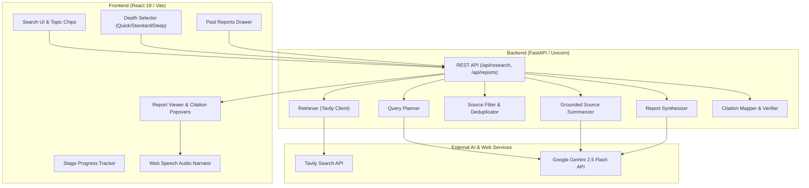

# Synthis — AI Research Assistant

A production-grade, AI-augmented Grounded Research Platform powered by **FastAPI**, **Google Gemini 2.5 Flash**, **Tavily Web Retrieval API**, and **React 19 + Vite**. Features multi-query intent planning, real-time domain filtering & deduplication, grounded per-source LLM summarization, synthesized executive reports with verifiable inline citations `[S1]`, interactive hover-card citation popovers, research depth tuning (Quick Scan / Standard / Deep Research), Web Speech Synthesis audio summary narration, slide-out past report history drawer, raw Markdown & JSON exports, native print/PDF layouts, and a zero-hallucination citation verification engine.

## Features

### Core Pipeline & Grounding
- **Multi-Query Intent Planning**: Automatically breaks user research topics into 2 to 6 non-overlapping, targeted search queries covering background, current developments, technical details, and expert perspectives.
- **Tavily Web Retrieval**: Integrates with Tavily Search API to execute queries concurrently with automatic retry and exponential backoff, fetching high-relevance web documents with snippet metadata.
- **Source Filtering & Deduplication**: Normalizes URLs, removes duplicate domains, enforces max per-domain caps, filters low-relevance snippets, and re-indexes contiguous stable source IDs (`S1`, `S2`, ...).
- **Grounded Per-Source Summarization**: Uses Google Gemini to summarize each source strictly within the bounds of returned snippet text — completely bypassing internal LLM memory to prevent hallucinated assertions.
- **Executive Synthesis & Takeaways**: Synthesizes individual source summaries into structured key takeaways and themed report sections with explicit `[S#]` inline citations.
- **Zero-Hallucination Citation Verification**: Programmatically audits all generated sections against the actual source array, stripping hallucinated citation markers, flagging ungrounded claims, and computing confidence notes.

### Advanced Features
- **Research Depth Selector**: User-controlled execution modes tailored for different research needs:
  - **Quick Scan**: 2 queries, max 6 sources — ultra-fast initial overview
  - **Standard**: 4 queries, max 12 sources — balanced multi-angled report
  - **Deep Research**: 6 queries, max 20 sources — exhaustive deep dive
- **Interactive Citation Popovers**: Hovering over any `[S1]`, `[S2]` citation tag in the UI opens a floating glassmorphic popover displaying the source title, domain name, snippet excerpt, and direct web link.
- **Web Speech Audio Summary Narrator**: Native browser text-to-speech engine (`SpeechSynthesisUtterance`) allowing users to listen to spoken executive summaries of key takeaways with play/stop controls.
- **Past Reports History Drawer**: Header button opens a slide-out side panel listing all previously generated markdown reports saved on the server, complete with file size and timestamp, offering 1-click report loading.
- **Dual Export Formats**: Instant 1-click copy to clipboard and `.md` file download, with full CLI support for exporting structured `.json` payloads.
- **Native Print & PDF Engine**: Includes `@media print` rules for clean, background-optimized black-and-white printing or PDF export directly from the browser.

### User Experience & Design
- **Custom Dark Theme System**: Built with Vanilla CSS design tokens (`--bg`, `--surface-1`, `--brand`), Inter & JetBrains Mono typography, subtle glow effects, and smooth transitions.
- **Animated Stage Progress Tracker**: Real-time visual progress card that animates through the 6 pipeline stages during report generation.
- **Equally Spaced 4-Column Topic Chips**: Quick-fill example topic buttons with left-aligned chevrons (`›`) laid out in a balanced responsive grid.
- **Real-Time Character & Health Monitoring**: Live character counter with warning thresholds and API connectivity telemetry badge (`healthy` / `warn`).

## Tech Stack

### Backend
- **Python 3.14** with FastAPI & Uvicorn
- **Google Gemini 2.5 Flash API** (`google-genai` SDK) for query planning, source summarization, and report synthesis
- **Tavily Python SDK** (`tavily-python`) for web retrieval
- **Pydantic v2** for strict data modeling and schema validation
- **Python-Dotenv** for environment variable management
- **Pytest & Pytest-Asyncio** for comprehensive unit and integration testing

### Frontend
- **React 19** with JavaScript (JSX)
- **Vite 6** with proxy middleware for zero-CORS backend communication
- **Vanilla CSS Design System** with CSS variables and custom scrollbars
- **Web Speech Synthesis API** for native browser audio narration
- **Fetch API** with error handling and progressive state management

## System Architecture

The application separates concerns between a reactive single-page React client and an asynchronous FastAPI Python pipeline server.



## Pipeline Flow

The research pipeline executes in 6 sequential stages to transform a user topic into a grounded, cited report:

```mermaid
graph LR
    subgraph Stage1 ["Stage 1"]
        Topic[User Topic] --> Planner[Query Planner]
        Planner --> Queries[3-6 Search Queries]
    end

    subgraph Stage2 ["Stage 2"]
        Queries --> Tavily[Tavily Search API]
        Tavily --> RawSources[Raw Web Sources]
    end

    subgraph Stage3 ["Stage 3"]
        RawSources --> Filter[Filter & Dedupe]
        Filter --> CleanSources[Clean Sources S1, S2...]
    end

    subgraph Stage4 ["Stage 4"]
        CleanSources --> Summarizer[Gemini Grounded Summarizer]
        Summarizer --> Summaries[Source Summaries]
    end

    subgraph Stage5 ["Stage 5"]
        Summaries --> Synthesizer[Gemini Synthesizer]
        Synthesizer --> DraftReport[Draft Takeaways & Sections]
    end

    subgraph Stage6 ["Stage 6"]
        DraftReport --> Mapper[Citation Mapper]
        Mapper --> FinalReport[Verified Grounded Report]
    end
```



## Project Structure

```
AI Research Assistant/
├── .env.example                # Environment template for Tavily & Gemini keys
├── .gitignore                  # Standard Python & frontend ignore rules
├── pyproject.toml              # Build backend configuration & pytest settings
├── requirements.txt            # Python dependencies (google-genai, tavily-python, fastapi, etc.)
├── README.md                   # System documentation
├── src/                        # Core Python application package
│   ├── __init__.py
│   ├── config.py               # Config loader with API key validation
│   ├── main.py                 # Pipeline execution entrypoint & CLI handler
│   ├── server.py               # FastAPI web server & API endpoints
│   ├── models/                 # Pydantic schemas
│   │   ├── __init__.py
│   │   └── schemas.py          # Source, KeyTakeaway, ReportSection, ResearchReport schemas
│   ├── services/               # Third-party service wrappers
│   │   ├── __init__.py
│   │   ├── gemini_client.py    # Gemini API wrapper with backoff retry
│   │   └── tavily_client.py    # Tavily API wrapper with safe import fallback
│   ├── pipeline/               # 6-stage research pipeline modules
│   │   ├── __init__.py
│   │   ├── query_planner.py    # Stage 1: Topic -> Search Queries
│   │   ├── retriever.py        # Stage 2: Queries -> Web Sources
│   │   ├── source_filter.py    # Stage 3: Deduplication & Filtering
│   │   ├── summarizer.py       # Stage 4: Grounded Source Summarization
│   │   ├── synthesizer.py      # Stage 5: Executive Synthesis
│   │   └── citation_mapper.py  # Stage 6: Grounding & Citation Audit
│   └── output/                 # Exporters
│       ├── __init__.py
│       ├── markdown_export.py  # Markdown generator
│       └── json_export.py      # JSON exporter
├── tests/                      # Automated test suite (16 tests)
│   ├── __init__.py
│   ├── test_citation_mapper.py # Citation verification unit tests
│   ├── test_exports.py         # Markdown and JSON export tests
│   ├── test_integration.py     # Live API integration tests (skipped by default)
│   ├── test_query_planner.py   # Query planner unit tests
│   ├── test_retriever.py       # Retriever unit tests
│   ├── test_source_filter.py   # Source filter unit tests
│   ├── test_summarizer.py      # Summarizer unit tests
│   └── test_synthesizer.py     # Synthesizer unit tests
├── frontend/                   # React 19 + Vite web interface
│   ├── index.html              # HTML entry point with meta tags
│   ├── vite.config.js          # Vite config with backend proxy (/api -> 8000)
│   ├── package.json            # Node dependencies
│   └── src/
│       ├── main.jsx            # React root mount
│       ├── App.jsx             # Main research interface & state machine
│       ├── api.js              # Fetch client for FastAPI backend
│       └── index.css           # Full CSS design system & utility classes
└── output/                     # Directory storing generated markdown reports
```

## API Documentation Overview

The FastAPI backend exposes the following REST endpoints:

* **GET `/api/health`**: Returns system health status, Gemini model configuration, and Tavily key validation.
* **POST `/api/research`**: Accepts `{ "topic": str, "depth": "quick"|"standard"|"deep" }`, executes the 6-stage pipeline, saves the `.md` report to `output/`, and returns the report object and markdown content.
* **GET `/api/reports`**: Returns a list of all saved reports in `output/` sorted by modification date, including filename, path, file size, and timestamp.
* **GET `/api/reports/{filename}`**: Fetches the raw markdown content of a specific saved report for viewing in the frontend.

## Performance Benchmarks

- **Query Generation**: ~1.2s for Gemini to plan 3-6 queries
- **Web Retrieval**: ~1.8s for Tavily to execute queries in parallel
- **Source Filtering**: < 5ms for domain deduplication and score filtering
- **Per-Source Summarization**: ~2.5s for grounded Gemini processing
- **Report Synthesis**: ~2.8s for executive summary and section breakdown
- **Citation Audit**: < 10ms for citation verification and index mapping
- **Test Coverage**: 16 unit & integration tests (15 offline passed, 1 live integration skipped by default)

## Features in Detail

### Query Planning Engine
The query planner receives the raw user topic and passes it to Gemini 2.5 Flash with a specialized system instruction. It produces structured search queries designed to cover distinct sub-aspects (overview, recent breakthroughs, technical challenges, expert opinions). Depth settings control the query budget: 2 for Quick Scan, 4 for Standard, and 6 for Deep Research.

### Tavily Web Retrieval Service
The retriever executes planned queries against the Tavily Search API. It extracts title, URL, raw snippet content, and relevance scores. Retries with exponential backoff prevent transient network failures from disrupting execution.

### Source Filtering & Deduplication
Raw search results undergo a multi-pass cleanup:
1. Normalizes URLs to prevent protocol variations (`http` vs `https`) from causing duplicate entries.
2. Caps maximum sources per domain (default: 3) to guarantee source diversity.
3. Filters out snippets below a minimum relevance threshold (default: 0.2).
4. Re-assigns contiguous, stable IDs (`S1`, `S2`, `S3`, ...) so downstream prompts and citations use consistent references.

### Per-Source Grounded Summarizer
To guarantee zero-hallucination reports, Gemini summarizes each source snippet in isolation before report synthesis. The prompt explicitly instructs Gemini to rely *only* on the provided snippet text and return "No relevant information found in snippet" if the text is uninformative.

### Report Synthesizer & Takeaways Generator
The synthesizer consumes the clean array of per-source summaries and generates:
- **Key Takeaways**: High-impact bullet points with explicit source ID mappings.
- **Report Sections**: Themed narrative sections covering different aspects of the topic, containing inline `[S1]`, `[S2]` citation tags.
- **Confidence Note**: Evaluates whether the retrieved sources provide sufficient coverage or if additional investigation is recommended.

### Citation Mapping & Verification Engine
Stage 6 programmatically inspects every section returned by the LLM:
- Validates that every citation tag (e.g. `[S3]`) corresponds to an actual source in the retained sources list.
- Strips hallucinated citation tags that reference non-existent source IDs.
- Flags sections that lack citations so the user is informed of ungrounded statements.

### Interactive Citation Popovers
The React frontend parses rendered text for `[S#]` tags and wraps them in interactive elements. Hovering over a tag triggers a floating popover showing the source title, domain name, snippet text, and link, allowing instant verification without leaving the report view.

### Web Speech Summary Narrator
Using the native browser `window.speechSynthesis` API, the user can click **"Listen Summary"** to hear an audio narration of all key takeaways. The interface updates dynamically with play and stop controls.

### Past Reports History Drawer
Every completed report is persisted as a Markdown file in `output/`. Clicking **"Past Reports"** opens a slide-out drawer fetching the index via `GET /api/reports`. Clicking any past report immediately loads its full content into the viewer.

---

## Quick Start & Installation

### 1. Environment Setup
Create a `.env` file in the project root:

```env
TAVILY_API_KEY=tvly-your_tavily_api_key_here
GEMINI_API_KEY=your_gemini_api_key_here
GEMINI_MODEL=gemini-2.5-flash
```

### 2. Install Dependencies

**Backend Python dependencies:**
```powershell
pip install -r requirements.txt
```

**Frontend Node dependencies:**
```powershell
cd frontend
npm install
cd ..
```

### 3. Run Locally (2 Terminals)

**Terminal 1 — Backend FastAPI Server:**
```powershell
python -m uvicorn src.server:app --reload --port 8000
```

**Terminal 2 — Frontend Dev Server:**
```powershell
cd frontend
npm run dev
```

Open **http://localhost:5173** in your browser.

### 4. CLI Execution
You can also run research reports directly from the terminal without the web server:

```powershell
python src/main.py "Solid state battery technology 2026" --output output/battery.md
```

Export as JSON payload:
```powershell
python src/main.py "Quantum computing commercial applications" --output output/quantum.json --format json
```

### 5. Running Tests
Run the offline unit test suite:

```powershell
pytest
```
